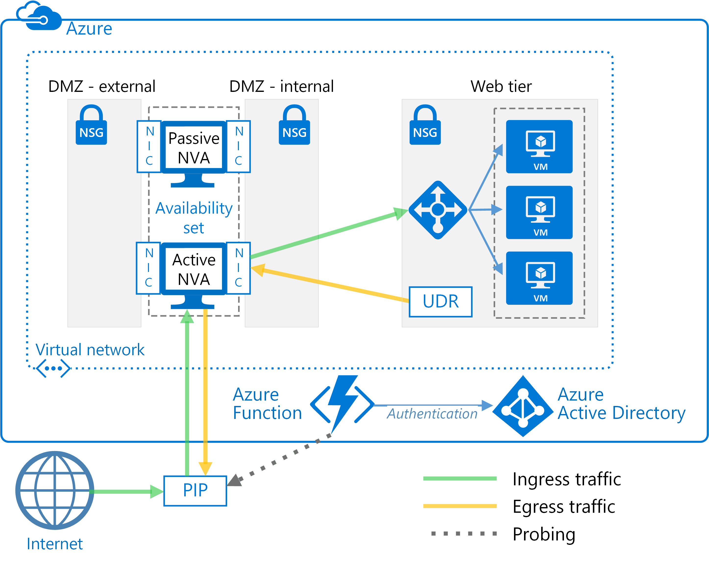
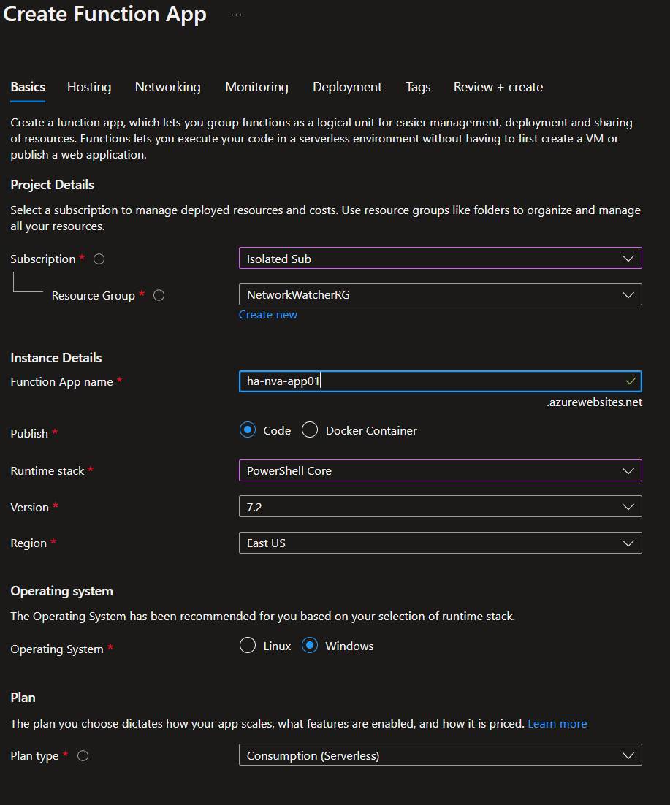

# Automated failover for network virtual appliances: 
## Supporting high availability with user-defined route tables on Microsoft Azure (Apply patch for Meraki vMX)

This guide shows you how to implement high availability for network virtual appliance (NVA) firewalls using custom route tables that direct traffic through
an active-passive NVA configuration. These user-defined routes (UDRs) override the Azure default system routes by directing traffic to the active NVA firewall in an active-passive pair. If the active NVA firewall fails for some reason, whether through a planned or unplanned outage, the route can failover to the secondary NVA firewall.

We designed this automated failover solution after working with Azure customers who cannot configure Source Network Address Translation (SNAT) for inbound requests on their NVA firewalls. SNAT hides the original source client IP address. If you need to log the original IPs or used them within other layered security components behind your NVAs, this solution offers a basic approach.

All the resources you need for this solution are available in this repository. For more information about UDRs, see [Custom routes](https://docs.microsoft.com/azure/virtual-network/virtual-networks-udr-overview#custom-routes).

## Architecture

This solution uses two Azure virtual machines to host the NVA firewall in an active-passive configuration as the following figure shows.

The failover of UDR table entries is automated by a next-hop address set to the IP address of an interface on the active NVA firewall virtual machine. The automated failover logic is hosted in a function app that you create using [Azure Functions](https://docs.microsoft.com/azure/azure-functions/).  Function apps offer several advantages. The failover code runs as a serverless function inside Azure Functions—deployment is convenient, cost-effective, and easy to maintain and customize. In addition, the function app is hosted within Azure Functions, so it has no dependencies on the virtual network. If changes to the virtual network impact the NVA firewalls, the function app continues to run
independently. Testing is more accurate as well, because it takes place outside the virtual network using the same route as the inbound client requests.

To check the availability of the NVA firewall, the function app code probes it in one of two ways:

-   By monitoring the state of the Azure virtual machines hosting the NVA firewall.

-   By testing whether there is an open port through the firewall to the back-end web server. For this option, the NVA must expose a socket via PIP for the function app code to test.

You choose the type of probe you want to use when you configure the function app.

## Prerequisites

This solution assumes that:

-   You have a subscription on Azure, Azure Government, Azure Germany, Azure China, or Azure Stack.

-   Your subscription has an existing deployment of two NVA firewalls in an availability set on an Azure virtual network. If you have not yet deployed NVA firewalls, this GitHub repository includes a template (azuredeploy.json) that you can use to deploy them on an existing virtual network.

-   You know how to route network traffic with a [route table](https://docs.microsoft.com/azure/virtual-network/tutorial-create-route-table-portal).

### Set up Azure resources

To get started, you need to assign permissions to an Azure service principal, which grants access to the required Azure resources, including Azure Functions. The function app used in this solution authenticates to Azure Active Directory using service principal credentials. This service principal also requires specific role-based access control (RBAC) permissions to enable the Azure resources to work together.

After you assign the permissions, you apply resource tags to the route table resources. By applying tags, you can easily retrieve all the route table resources in your subscription by name. The function app deployed in this solution automates the failover of user-defined route table entries with a next hop address set to the IP address of an interface on the first NVA firewall virtual machine. You assign a resource tag name and value to each route table resource for which the function app will manage automated failover.

> **NOTE:** The resource group(s) containing route table resources can exist in the same Azure subscription where the NVA firewall virtual machines are deployed or a different Azure subscription, as long as all Azure subscriptions exist under a common Azure Active Directory tenant.

To set up the Azure resources:

1.  [Create a new service principal](https://docs.microsoft.com/azure/azure-resource-manager/resource-group-create-service-principal-portal#create-an-azure-active-directory-application) in Azure Active Directory.

2.  Take note of the service principal application ID, key value, and Azure Active Directory tenant ID. You will need these to set up Azure Functions later.

3.  [Assign RBAC permissions to the service principal](https://docs.microsoft.com/azure/active-directory/role-based-access-control-configure) for Azure **subscription** and **resource group**.  
    1. For the **subscription** containing the NVA firewall virtual machines, assign the **Reader** role.
       Meraki vMX's resource group has limited privileges to change the settings, so we will configure the settings for the higher level subscription.
    2. For the **resource group(s)** containing route table resources, assign the **Contributor** role.

4.  [Configure the resource tag name and value](https://docs.microsoft.com/azure/azure-resource-manager/resource-group-using-tags#portal) for each route table resource managed by the function app using the following:

    1.  For the name, use **nva\_ha\_udr**.

    2.  For the value, enter text that describes this deployment. You will need this value for the next set of steps (note that the value is the case-sensitive).

### Set up Azure Functions

The next step is to create and configure the function app using Azure Functions, and then deploy the code. You create the function app in the same Azure subscription that contains the NVA firewall virtual machine. You have the choice to configure the function app to monitor either the status of the virtual machines or the TCP port.

Before continuing, make sure to have the following values specific to this deployment:

-   Application ID and key value of the service principal you set up.

-   Azure Active Directory tenant ID.

-   Subscription ID for the Azure subscription in which the NVA firewall virtual
    machines are deployed.

-   Name of the virtual machine hosting the first NVA firewall instance.

-   Name of the virtual machine hosting the second NVA firewall instance.

-   Name of the resource group containing the NVA firewall virtual machines.

-   Value you assigned earlier to the **nva\_ha\_udr** resource tag for each resource group containing route table resources.

The function app is deployed with a timer trigger defined in the function.json file. The default value for this timer trigger causes the function app to run every 30-seconds. It is not recommended to shorten this interval. You can lengthen it, but if you do, test the function app to validate that the function code executes frequently enough to respond to NVA firewall failover needs within an acceptable time period.

To create, configure, and deploy the function app:

1.  In Azure portal, log on to the same Azure subscription where the NVA firewall virtual machines are deployed.

2.  [Create a new function app](https://docs.microsoft.com/azure/azure-functions/functions-create-first-azure-function#create-a-function-app). Do not attempt to create or test the function code at this point—just create the function app.

    

3.  Navigate to the newly created function app and click the [Platform features](https://docs.microsoft.com/azure/azure-functions/functions-how-to-use-azure-function-app-settings#platform-features-tab) tab.

4.  Click [Application settings](https://docs.microsoft.com/azure/azure-functions/functions-how-to-use-azure-function-app-settings#settings) and add the following variables and values:

| Variable                    | Value                                                                                   |
|-----------------------------|-----------------------------------------------------------------------------------------|
| FUNCTIONS_EXTENSION_VERSION | ~1 (Deal with [issue](https://github.com/Azure/ha-nva-fo/issues/7))                     |
| SP\_USERNAME                | Application ID of the service principal                                                 |
| SP\_PASSWORD                | Key value of the service principal                                                      |
| TENANTID                    | Azure Active Directory tenant ID                                                        |
| SUBSCRIPTIONID              | Azure subscription ID                                                                   |
| AZURECLOUD                  | Either *AzureCloud* or *AzureUSGovernment*                                              |
| FW1NAME                     | Name of the virtual machine hosting the first NVA firewall instance                     |
| FW2NAME                     | Name of the virtual machine hosting the second NVA firewall instance                    |
| FW1RGNAME                   | Name of the resource group containing the first NVA firewall virtual machines           |
| FW2RGNAME                   | Name of the resource group containing the second NVA firewall virtual machines          |
| FWUDRTAG                    | Resource tag value                                                                      |
| FWTRIES                     | *3* (enables three retries for checking firewall health before returning “Down” status) |
| FWDELAY                     | *2* (enables two seconds between retries)                                               |
| FWMONITOR                   | Either *VMStatus* or *TCPPort*                                                          |
| FWMAILDOMAINMX              | DNS domain name containing MX record for sending email alerts                           |
| FWMAILFROM                  | Email address to use as “From:” address on email alerts                                 |
| FWMAILTO                    | Email address to which email alerts should be sent                                      |

5.  If you set FWMONITOR to *TCPPort*, add the following application setting variables and values:

| Variable | Value                                                                                      |
|----------|--------------------------------------------------------------------------------------------|
| FW1FQDN  | Publicly accessible FQDN or IP address for the first NVA firewall virtual machine instance |
| FW1PORT  | TCP port on which the first NVA firewall virtual machine instance is listening             |
| FW2FQDN  | Publicly accessible FQDN or IP address for second NVA firewall virtual machine instance    |
| FW2PORT  | TCP port on which the second NVA firewall virtual machine instance is listening            |

6.  On the **Platform features** tab, click **Deployment options**, and then
    click the **Setup** button.

7.  To set up a new deployment option, specify the following configuration:

    1.  **Choose Source**: External Repository

    2.  **Repository URL**: <https://github.com/[repo-name]/ha-nva-fo>  
        Please change it in the appropriate Repository URL.

    3.  **Branch**: *patch-meraki-vmx*  
        Please change it in the appropriate Branch.

    4.  **Repository Type**: Git

    

8.  Click **OK** to finish setting up the function app code.

9.  Click the **Sync** button to retrieve and deploy the function code.

> **NOTE:** After you deploy the code and complete the initial testing described in the next section, click the **Disconnect** button to disconnect the function app from the deployment repository so that future public repository updates are not automatically deployed.

### Test the function app

After the Azure function app has been configured and deployed, use these steps to test automated failover between NVAs:

1.  If the Azure function app is configured such that FWMONITOR = "VMStatus", do the following:

    1.  Confirm that requests are flowing through the primary NVA (FW1) to internal applications.

    2.  Stop the virtual machine on the primary NVA (FW1).

    3.  Monitor the Azure function app logs to ensure that a failover is performed.

    4.  Confirm that you received an email alert about the failover process.

    5.  Confirm that traffic is now flowing through the secondary NVA (FW2) to internal applications.

2.  If the Azure function app is configured such that FWMONITOR = "TCPPort", do the following:

    1.  Confirm that requests are flowing through the primary NVA (FW1) to internal applications.

    2.  Apply a network security group (NSG) to the external NIC of the primary NVA (FW1) that blocks inbound network traffic on the TCP port being monitored.

    3.  Monitor the Azure function app Logs to ensure that a failover is performed.

    4.  Confirm that you received an email alert about the failover process.

    5.  Confirm that traffic is now flowing through the secondary NVA (FW2) to internal applications.

## Next steps

This solution is basic by design so you can tailor it to your environment. How you integrate this approach into your end-to-end environment can vary considerably depending on the security components or other controls you have deployed. For example, a common next step is to add more alerts and notifications. Another option is to integrate the logs from the function app with the tools you use for security and network monitoring. If your environment includes a layer of additional security controls around the NVAs, you might need to add more routes to the route tables.

## Learn more

* [Virtual network traffic routing: Custom routes](https://docs.microsoft.com/azure/virtual-network/virtual-networks-udr-overview#custom-routes)

* [Tutorial: Route network traffic with a route table using the Azure portal](https://docs.microsoft.com/azure/virtual-network/tutorial-create-route-table-portal)

* [Azure Functions documentation](https://docs.microsoft.com/azure/azure-functions/)

* [Azure Virtual Network Appliances](https://azure.microsoft.com/solutions/network-appliances/)

* [vMX Setup Guide for Microsoft Azure](https://documentation.meraki.com/MX/MX_Installation_Guides/vMX_Setup_Guide_for_Microsoft_Azure)

* [Deploying Highly Available vMX in Azure](https://documentation.meraki.com/MX/Other_Topics/Deploying_Highly_Available_vMX_in_Azure)
